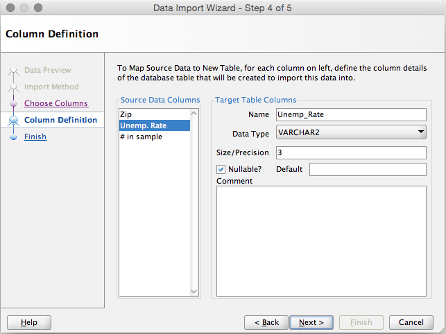

###FINAL PROJECT
Link to repo:
<https://github.com/sarstanc/DV_FinalProject>

###Link to datasets online
Utility rates by zipcode:
<https://catalog.data.gov/dataset/u-s-electric-utility-companies-and-rates-look-up-by-zipcode-feb-2011-57a7c>

Unemployment rates by zipcode:
<http://blog.splitwise.com/2014/01/06/free-us-population-density-and-unemployment-rate-by-zip-code/>

Population by zipcode:
<http://blog.splitwise.com/2013/09/18/the-2010-us-census-population-by-zip-code-totally-free/>

We truncated the data to zipcodes in Texas, Oklahoma, and Louisiana (zipcodes between 70000-80000) to limit the focus and decrease the size of the file.

###Load csv files into Oracle

###Load data into Tableau

###Data blending in Tableau

Use Population by zipcode as the primary dataset and Unemployment and Utilities as the secondary datasets.

###Creating a calculated field

