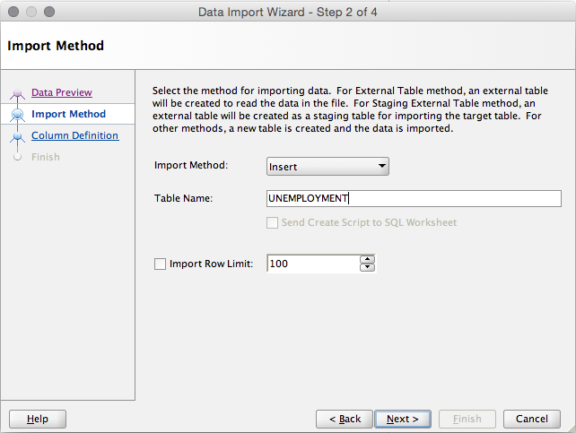

###FINAL PROJECT: Utility Rates and Unemployment
Link to repo:
<https://github.com/sarstanc/DV_FinalProject>


###Link to datasets online
Utility rates by zipcode:
<https://catalog.data.gov/dataset/u-s-electric-utility-companies-and-rates-look-up-by-zipcode-feb-2011-57a7c>

Unemployment rates by zipcode:
<http://blog.splitwise.com/2014/01/06/free-us-population-density-and-unemployment-rate-by-zip-code/>

Population by zipcode:
<http://blog.splitwise.com/2013/09/18/the-2010-us-census-population-by-zip-code-totally-free/>

We truncated the data to zipcodes in Texas, Oklahoma, and Louisiana (zipcodes between 70000-80000) to limit the focus and decrease the size of the file.


###Load csv files into Oracle

  
Select the csv file to import  
  
Check that left and right enclosures do not conflict with data  
  
Name the table  
  
Choose all columns that go into the Oracle table  
  
Change column names to remove spaces and starting numbers  


###Load data into Tableau

  
Load each data set one at a time to blend rather than join  


###Data blending in Tableau
  
Edit relationships between data sets to link common columns  
  
Existing relationships will appear here. Select "custom" to change.  
  
Use Population by zipcode as the primary dataset and Unemployment and Utilities as the secondary datasets.  
  
  
Orange indicates the secondary data sources  

###Creating a calculated field
  
Resrate, Indrate, and Comrate are all dimensions from the Utility Rates data source. Since these dimensions contain string values, they must individually be converted to integers in order to calculate an average.  


###Creating visualizations in Tableau
  
Crosstabs with utility company name and unemployment rate by zip code
 
Generate longitude and latitude to show residential utility rates compared to population by zip code
  
Filter out null residential utility costs
  
Bar graph shows average utility cost broken down into residential, commercial, and industrial costs per zip code
  
Filter out null and 0 value utility costs


###Creating visualizations in R
```{r, warning=FALSE}
source("../04_R/unemployment_rank.R")
```
3 part join  

```{r, warning=FALSE}
source("../04_R/avgrate.R")
```
Multiplied by -1 to workaround for calculated field

